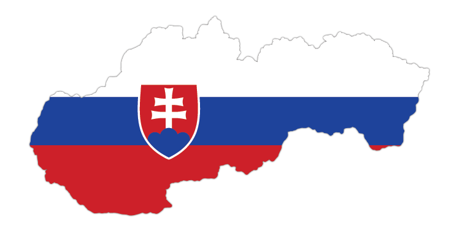

<div id="top"></div>
<!--
*** Thanks for checking out the Best-README-Template. If you have a suggestion
*** that would make this better, please fork the repo and create a pull request
*** or simply open an issue with the tag "enhancement".
*** Don't forget to give the project a star!
*** Thanks again! Now go create something AMAZING! :D
-->

<!-- PROJECT SHIELDS -->
<!--
*** I'm using markdown "reference style" links for readability.
*** Reference links are enclosed in brackets [ ] instead of parentheses ( ).
*** See the bottom of this document for the declaration of the reference variables
*** for contributors-url, forks-url, etc. This is an optional, concise syntax you may use.
*** https://www.markdownguide.org/basic-syntax/#reference-style-links
-->

[![Contributors][contributors-shield]][contributors-url]
[![Forks][forks-shield]][forks-url]
[![Stargazers][stars-shield]][stars-url]
[![Issues][issues-shield]][issues-url]
[![Apache-2.0 License][license-shield]][license-url]
[![Codecov coverage][codecov-coverage]][codecov-url]
<!-- PROJECT LOGO -->
<br />
<div align="center">
  <a href="https://github.com/karafra/bunkers-of-slovakia">
    
  </a>

<h3 align="center">Bunkers of Slovakia </h3>

  <p align="center">
    Simple interactive map of Slovakian war bunkers
    <br />
    <br />
    <a href="https://github.com/karafra/bunkers-of-slovakia">View Demo</a>
    ·
    <a href="https://github.com/karafra/bunkers-of-slovakia/issues">Report Bug</a>
    ·
    <a href="https://github.com/karafra/bunkers-of-slovakia/issues">Request Feature</a>
  </p>
</div>

<!-- TABLE OF CONTENTS -->
<details>
  <summary>Table of Contents</summary>
  <ol>
    <li>
      <a href="#about-the-project">About The Project</a>
      <ul>
        <li><a href="#built-with">Built With</a></li>
      </ul>
    </li>
    <li>
      <a href="#getting-started">Getting Started</a>
      <ul>
        <li><a href="#prerequisites">Prerequisites</a></li>
        <li><a href="#installation">Installation</a></li>
      </ul>
    </li>
    <li><a href="#usage">Usage</a></li>
    <li><a href="#roadmap">Roadmap</a></li>
    <li><a href="#contributing">Contributing</a></li>
    <li><a href="#license">License</a></li>
    <li><a href="#contact">Contact</a></li>
  </ol>
</details>

<!-- ABOUT THE PROJECT -->

## About The Project

[![Product Name Screen Shot][product-screenshot]](https://bunkers-of-slovakia.herokuapp.com/)

Simple interactive map of all publicly known bunkers in Slovakia, map includes WW1, WW2, Cold war and post cold war bunkers.

<p align="right">(<a href="#top">back to top</a>)</p>

### Built With

- [React.js](https://reactjs.org/)
- [Deck.gl](https://deck.gl)
- [Jest](https://jestjs.io/)
- [Prettier](https://prettier.io/)
- [DeckTypings](@danmarshall/deckgl-typings)

<p align="right">(<a href="#top">back to top</a>)</p>

<!-- GETTING STARTED -->

## Getting Started

### Prerequisites

For running this project you need [Node.js](https://nodejs.org/en/) and [Yarn](https://yarnpkg.com/).

- Node.js

  For installing Node.js follow steps mentioned [here](https://docs.npmjs.com/downloading-and-installing-node-js-and-npm)

- yarn
  ```sh
  npm install --global yarn
  ```

### Installation

1. Clone the repo
   ```sh
   git clone https://github.com/karafra/bunkers-of-slovakia.git
   ```
2. Install NPM packages
   ```sh
   yarn
   ```
3. Run app
   ```sh
   yarn start
   ```

Application should now be running at [http://localhost:3000](http://localhost:3000) 🚀

<p align="right">(<a href="#top">back to top</a>)</p>

<!-- USAGE EXAMPLES -->

## Usage

Using this application is just as simple as using any other application involving maps such as [Google maps](https://maps.google.com). Just scroll and enjoy 🤷

<!--
_For more examples, please refer to the [Documentation](https://bunkers-of-slovakia.herokuapp.com/)_

-->

<p align="right">(<a href="#top">back to top</a>)</p>

<!-- ROADMAP -->

## Roadmap

- [ ] Add CI
- [ ] Add Codecov coverage
- [ ] Fix top bar as it seems empty
- [ ] Add current location pointer

See the [open issues](https://github.com/karafra/bunkers-of-slovakia/issues) for a full list of proposed features (and known issues).

<p align="right">(<a href="#top">back to top</a>)</p>

<!-- CONTRIBUTING -->

## Contributing

Contributions are what make the open source community such an amazing place to learn, inspire, and create. Any contributions you make are **greatly appreciated**.

If you have a suggestion that would make this better, please fork the repo and create a pull request. You can also simply open an issue with the tag "enhancement".
Don't forget to give the project a star! Thanks again!

1. Fork the Project
2. Create your Feature Branch (`git checkout -b feature/AmazingFeature`)
3. Commit your Changes (`git commit -m 'Add some AmazingFeature'`)
4. Push to the Branch (`git push origin feature/AmazingFeature`)
5. Open a Pull Request

<p align="right">(<a href="#top">back to top</a>)</p>

<!-- LICENSE -->

## License

Distributed under the MIT License. See [LICENSE](./LICENSE) for more information.

<p align="right">(<a href="#top">back to top</a>)</p>

<!-- CONTACT -->

## Contact

Your Name - [@karafro](https://twitter.com/karafro) - dariusKralovic@protonmail.com

Project Link: [https://github.com/karafra/bunkers-of-slovakia](https://github.com/karafra/bunkers-of-slovakia)

<p align="right">(<a href="#top">back to top</a>)</p>

<!-- MARKDOWN LINKS & IMAGES -->
<!-- https://www.markdownguide.org/basic-syntax/#reference-style-links -->

[contributors-shield]: https://img.shields.io/github/contributors/karafra/bunkers-of-slovakia.svg?style=for-the-badge
[contributors-url]: https://github.com/karafra/bunkers-of-slovakia/graphs/contributors
[forks-shield]: https://img.shields.io/github/forks/karafra/bunkers-of-slovakia.svg?style=for-the-badge
[forks-url]: https://github.com/karafra/bunkers-of-slovakia/network/members
[stars-shield]: https://img.shields.io/github/stars/karafra/bunkers-of-slovakia.svg?style=for-the-badge
[stars-url]: https://github.com/karafra/bunkers-of-slovakia/stargazers
[issues-shield]: https://img.shields.io/github/issues/karafra/bunkers-of-slovakia.svg?style=for-the-badge
[issues-url]: https://github.com/karafra/bunkers-of-slovakia/issues
[license-shield]: https://img.shields.io/github/license/karafra/bunkers-of-slovakia.svg?style=for-the-badge
[license-url]: https://github.com/karafra/bunkers-of-slovakia/blob/master/LICENSE
[linkedin-shield]: https://img.shields.io/badge/-LinkedIn-black.svg?style=for-the-badge&logo=linkedin&colorB=555
[linkedin-url]: https://linkedin.com/in/linkedin_username
[product-screenshot]: .github/img/screenshot.gif
[codecov-coverage]: https://img.shields.io/codecov/c/gh/karafra/bunkers-of-slovakia?style=for-the-badge&token=bs2rstsAzY
[codecov-url]: https://app.codecov.io/gh/karafra/bunkers-of-slovakia
